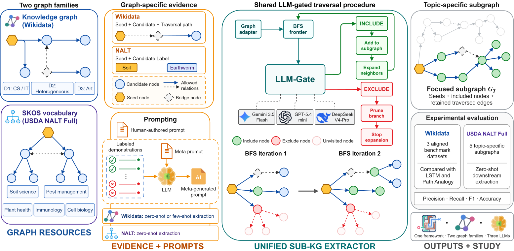

# Sub-KG Extractor

> A unified framework for topic-specific sub-knowledge graph extraction with
> LLM-gated graph traversal.

[](https://www.python.org/)
[](LICENSE)

Sub-KG Extractor bootstraps a focused set of entities or concepts from a broad
knowledge graph or controlled vocabulary. For an intended topic, it uses seed
nodes and allowed traversal relations to perform breadth-first search (BFS) and
asks a large language model to classify each reached candidate as `INCLUDE` or
`EXCLUDE`. Included candidates are retained and may be expanded; excluded
candidates stop traversal along that route.

Sub-KG Extractor uses structured LLM decisions for traversal gating and
supports directly human-authored prompts and meta-generated prompts derived
from labeled demonstration sets.

The repository contains:

- a standalone `subkg_extractor.py` entry point for RDF knowledge graphs and
  SKOS vocabularies;
- a Wikidata benchmark implementation with real-time and Batch API workflows;
- a USDA NALT Full adapter for extracting topic-specific concept sets from a
  SKOS thesaurus;
- prompts, decision records, metrics, and experiment reports;
- an aligned reproduction of the LSTM and Path Analogy baselines.

Each evaluation row is the serialized record of one candidate decision
instance. We use **decision instance** for the semantic evaluation unit and
**row** only when referring to CSV records, artifact fields, or command-line
sampling.

## Method



A graph adapter supplies seed nodes, candidate labels, allowed relations, and
optional path evidence. The same traversal procedure is used for:

- **Wikidata:** seed-candidate paths with relation labels and, where needed,
  unclassified intermediate bridge nodes;
- **USDA NALT Full:** English preferred and alternative labels connected by
  `skos:broader`, `skos:narrower`, and `skos:related`.

The runners persist included, excluded, visited, and per-decision prediction
artifacts. Retained node sets represent the extracted subgraphs.

## Prompting settings

The Wikidata workflow provides four CLI prompting strategies; `manual` denotes
a human-authored prompt.

| Prompt source | Extraction-time demonstrations | CLI strategy |
|---|---|---|
| Human-authored | None | `zero_shot_manual` |
| Human-authored | Included | `few_shot_manual` |
| Meta-generated | None | `zero_shot_meta` |
| Meta-generated | Included | `few_shot_meta` |

NALT uses zero-shot extraction for both prompt sources. Meta-prompt generation
is conditioned on the labeled demonstration set.

## Benchmarks

### Wikidata

The checked-in Wikidata benchmarks use labeled seed-path-candidate decision
instances and local subgraphs reconstructed at 2022 Wikidata revisions.

| Dataset | Domain | Raw decision instances | Aligned runtime decision instances |
|---|---|---:|---:|
| Dataset 1 | Computer science and information technology | 5,233 | 4,400 |
| Dataset 2 | Heterogeneous domains such as food, sport, and science | 982 | 868 |
| Dataset 3 | Art and works of art | 2,111 | 1,384 |

Datasets 1 and 2 originate from the
[Analogical Pruning benchmark](https://doi.org/10.1145/3583780.3615030).
Dataset 3 is the
[Wikidata artwork dataset](https://doi.org/10.5281/zenodo.15600971) associated
with the cultural-heritage use case of
[KGPrune](https://doi.org/10.3233/FAIA241038).

The aligned runtime sets contain the common decision instances used for direct
comparison with the reproduced LSTM and Path Analogy baselines. The Wikidata
report also contains the larger full-common-set prompting views and documents
all filtering and BFS-gated scoring rules.

### USDA NALT Full

The NALT adapter evaluates five topic-rooted benchmarks:

- Soil science
- Pest management
- Plant health
- Immunology
- Cell biology

Each run starts from one or two internal seed concepts. The benchmark topic
root is removed from traversal and scoring so that it cannot provide direct
access to the complete target hierarchy. The official
[USDA NALT Full](https://lod.nal.usda.gov/nalt/en/) Turtle export is resolved
locally or downloaded by the NALT runner when needed.

## Main results

### Wikidata aligned runtime sets

The table reports the best Sub-KG Extractor configuration on each aligned set.
All three are Gemini 3.5 Flash with few-shot human-authored prompting. Every
method is scored on the same aligned decision instances. The first view
averages fold-level metrics using the number of scored decision instances in
each fold as the weight; the second computes each metric once after pooling all
five folds.

Five-fold results weighted by scored decision-instance count:

| Dataset | Precision | Recall | F1 | Accuracy | Strongest reproduced baseline F1 |
|---|---:|---:|---:|---:|---:|
| Dataset 1 | 0.855 | 0.771 | **0.810** | 0.870 | 0.746 (LSTM) |
| Dataset 2 | 0.940 | 0.934 | **0.936** | 0.919 | 0.846 (Path Analogy) |
| Dataset 3 | 0.849 | 0.911 | **0.877** | 0.905 | 0.845 (LSTM) |

Pooled-prediction results:

| Dataset | Precision | Recall | F1 | Accuracy | Strongest reproduced baseline F1 |
|---|---:|---:|---:|---:|---:|
| Dataset 1 | 0.856 | 0.771 | **0.811** | 0.870 | 0.748 (LSTM) |
| Dataset 2 | 0.945 | 0.932 | **0.939** | 0.919 | 0.848 (Path Analogy) |
| Dataset 3 | 0.852 | 0.909 | **0.880** | 0.905 | 0.845 (LSTM) |

### NALT zero-shot topic extraction

| Topic | Best prompt/model | Precision | Recall | F1 | Accuracy |
|---|---|---:|---:|---:|---:|
| Soil science | Human-authored / DeepSeek-V4-Pro | 0.931 | 0.856 | **0.892** | 0.852 |
| Pest management | Human-authored / Gemini 3.5 Flash | 0.942 | 0.950 | **0.946** | 0.921 |
| Plant health | Human-authored / DeepSeek-V4-Pro | 0.968 | 0.959 | **0.963** | 0.967 |
| Immunology | Human-authored / DeepSeek-V4-Pro | 0.777 | 0.904 | **0.836** | 0.831 |
| Cell biology | Meta-generated / DeepSeek-V4-Pro | 0.885 | 0.725 | **0.797** | 0.811 |

NALT precision, recall, and F1 use a fixed held-out positive set for each topic.
NALT accuracy also includes visited non-descendants, so its
negative evaluation universe is traversal-dependent.

Detailed metrics and artifact paths are available in:

- [Wikidata prompting report](meta-prompting/REPORT.md)
- [NALT prompting report](usecase/REPORT.md)
- [LSTM and Path Analogy reproduction report](reproduction/REPORT.md)
- [NALT demonstration-count ablation](usecase/ablation/REPORT.md)

## Repository structure

```text
.
├── subkg_extractor.py                # Unified RDF KG/SKOS extraction CLI
├── meta-prompting/
│   ├── subkg_extractor_wikidata.py   # Wikidata prompt generation/evaluation CLI
│   ├── full_dataset_batch_runner.py  # Gemini and OpenAI Batch API workflow
│   ├── prompts/                      # Human-authored and meta-generated prompts
│   ├── examples/                     # Human-authored and meta-prompting demonstrations
│   ├── results/                      # Retained full-dataset outputs
│   └── REPORT.md
├── usecase/
│   ├── subkg_extractor_nalt.py       # NALT extraction and prompt experiments
│   ├── prompts/
│   ├── results/
│   ├── ablation/
│   └── REPORT.md
├── reproduction/
│   ├── src/                          # Adapted baseline implementation
│   ├── folds/                        # Fixed five-fold seed splits
│   ├── results/                      # Metrics and complete decision records
│   ├── README.md
│   └── REPORT.md
├── wikidata/
│   ├── dataset1/
│   ├── dataset2/
│   ├── dataset3/
│   └── sample_subgraphs_2022.py
├── requirements.txt
└── LICENSE
```

## Installation

The main Wikidata and NALT workflows require Python 3.10 or newer.

```bash
python -m venv .venv
```

Activate the environment:

```bash
# Linux or macOS
source .venv/bin/activate
```

```powershell
# Windows PowerShell
.\.venv\Scripts\Activate.ps1
```

Install the main dependencies:

```bash
python -m pip install --upgrade pip
python -m pip install -r requirements.txt
```

The TensorFlow baseline reproduction uses a separate Python 3.10 or 3.11
environment and `reproduction/requirements.txt`; see
[reproduction/README.md](reproduction/README.md).

## API configuration

Set the environment variable for the provider you intend to use:

| Provider | Environment variable |
|---|---|
| OpenAI | `OPENAI_API_KEY` |
| Google Gemini | `GEMINI_API_KEY` or `GOOGLE_API_KEY` |
| DeepSeek | `DEEPSEEK_API_KEY` |
| OpenRouter | `OPENROUTER_API_KEY` |

Alternatively, create an ignored `config` file at the repository root:

```json
{
  "openai_api_key": "...",
  "gemini_api_key": "...",
  "deepseek_api_key": "...",
  "openrouter_api_key": "..."
}
```

LLM evaluation commands incur provider charges. Start with a small sample
before launching full-dataset inference.

## Quick start: unified extractor

The root entry point accepts any local RDF graph supported by RDFLib. A seed
may be a full IRI, prefixed name, unique local identifier, or unambiguous graph
label. Its automatic classifier assigns the target to the path-aware KG adapter
or the label-only SKOS adapter; use `--graph-type kg` or `--graph-type skos` to
override that decision.

The default meta-prompting route expects a JSON or CSV labeled demonstration
set containing only decision nodes and decisions. For JSON, use:

```json
{
  "examples": [
    {"node": "Q105599390", "decision": "INCLUDE"},
    {"node": "Q15087423", "decision": "EXCLUDE"}
  ]
}
```

The extractor first resolves one effective allowed-relation list, then uses
that same list for demonstration-path reconstruction and gated BFS. An
explicit `--allowed-relation` list overrides the defaults. Without an
override, SKOS uses `skos:broader`, `skos:narrower`, and `skos:related` in both
directions; KG uses every predicate that connects two labeled URI nodes, also
in both directions. Blank nodes, literals, and unlabeled URI nodes are not
traversable. For KG inputs, the reconstructed demonstration paths become
evidence for prompt generation; for SKOS inputs, the downstream prompt remains
label-only.

Inspect the complete prepared plan without creating a provider client or
making any API call:

```bash
python subkg_extractor.py \
  --graph wikidata/dataset1/dataset1_subgraph_2022.ttl \
  --seed Q178051 \
  --examples examples.json \
  --dry-run
```

Remove `--dry-run` to generate the system prompt and run LLM-gated BFS. Select
Gemini, OpenAI, DeepSeek, or OpenRouter with `--provider` and `--model`.

A user-authored system prompt bypasses prompt generation, so demonstrations are
optional:

```bash
python subkg_extractor.py \
  --graph target-graph.ttl \
  --seed https://example.org/seed \
  --system-prompt system-prompt.md \
  --allowed-relation https://example.org/relation \
  --provider openai \
  --model gpt-5.4-mini
```

Repeat `--allowed-relation` for multiple relations. Prefix a KG relation with
`^` to traverse its inverse direction. The resulting `subgraph.ttl` is
traversal-derived: it contains only seed and included nodes, the retained
source-graph edges used to reach included nodes, and the exact graph labels
shown to the downstream LLM. It does not copy unrelated metadata or additional
edges merely because both endpoints were included.

## Quick start: Wikidata

### Run a small direct BFS evaluation

This example scores a deterministic 30-row sample with three concurrent API
workers and writes artifacts under `tmp/`. BFS may classify additional
traversal candidates; `--sample-size` controls the scored rows.

```bash
python meta-prompting/subkg_extractor_wikidata.py evaluate \
  --dataset 1 \
  --context-level path_simple \
  --eval-mode bfs \
  --prompt-file meta-prompting/prompts/manual_dataset1.md \
  --examples-file meta-prompting/examples/dataset1_path_simple_manual_examples.json \
  --prompt-setting zero_shot_manual \
  --sample-size 30 \
  --batch-size 10 \
  --workers 3 \
  --provider openai \
  --model gpt-5.4-mini \
  --output-dir tmp/wikidata-smoke \
  --sample-output-dir tmp/wikidata-samples
```

Use `--sample-size 0` only when intentionally evaluating every eligible row.
For few-shot human-authored prompting, change the strategy to
`few_shot_manual`; the runner then appends the selected demonstration set to
the system prompt.

### Generate a dataset-specific meta prompt

```bash
python meta-prompting/subkg_extractor_wikidata.py generate \
  --dataset 1 \
  --context-level path_simple \
  --examples-file meta-prompting/examples/meta/dataset1_path_simple_meta_examples.json \
  --provider deepseek \
  --model deepseek-v4-pro \
  --output tmp/prompts/dataset1_deepseek.md
```

Use the generated file with `evaluate` and select either `zero_shot_meta` or
`few_shot_meta`. Prompt generation uses the model-specific reasoning
configuration encoded by the runner; extraction uses provider-default
reasoning.

### Run a full-dataset Batch API job

Gemini and OpenAI full-dataset jobs evaluate decision instances through their
Batch APIs and then reconstruct the same BFS-gated prediction view during
scoring. Candidates made unreachable by an upstream exclusion are assigned
`EXCLUDE`, matching real-time BFS semantics.

Submit a Gemini job:

```bash
python meta-prompting/full_dataset_batch_runner.py submit \
  --dataset 1 \
  --strategy few_shot_manual \
  --provider gemini \
  --model gemini-3.5-flash \
  --output-dir tmp/batch/gemini-3.5-flash
```

The command prints a batch job name and writes a manifest. Check, download, and
score the completed job with:

```bash
python meta-prompting/full_dataset_batch_runner.py status \
  --provider gemini \
  --job-name <job-name>

python meta-prompting/full_dataset_batch_runner.py download \
  --manifest tmp/batch/gemini-3.5-flash/dataset1/few_shot_manual/manifest.json

python meta-prompting/full_dataset_batch_runner.py score \
  --manifest tmp/batch/gemini-3.5-flash/dataset1/few_shot_manual/manifest.json
```

The batch runner automatically records prompt and demonstration hashes,
request rows, provider job identifiers, raw responses, BFS-gated predictions,
and summary metrics in the strategy directory.

## Quick start: USDA NALT Full

List the available benchmark presets:

```bash
python usecase/subkg_extractor_nalt.py extract --list-benchmarks
```

Run zero-shot Soil science extraction with the human-authored prompt:

```bash
python usecase/subkg_extractor_nalt.py \
  extract \
  --benchmark soil_science \
  --prompt-file usecase/prompts/manual/soil_science.md \
  --result-mode zero_shot_manual \
  --llm-provider deepseek \
  --llm-model deepseek-v4-pro \
  --output-dir tmp/nalt-results
```

If `--nalt-ttl` is omitted, the runner checks common local locations and then
downloads the official Turtle export. Pass `--nalt-ttl path/to/nalt-full.ttl`
to use an existing copy.

Generate a new NALT meta prompt:

```bash
python usecase/subkg_extractor_nalt.py generate \
  --benchmark soil_science \
  --provider deepseek \
  --model deepseek-v4-pro \
  --output tmp/nalt-prompts/soil_science.md
```

Validate the checked-in NALT prompts and demonstration sets:

```bash
python usecase/subkg_extractor_nalt.py validate-artifacts
```

## Baseline reproduction

The `reproduction/` workflow evaluates LSTM and Path Analogy on 4,400, 868,
and 1,384 aligned decision instances for Datasets 1--3. It preserves one
prediction for every evaluated instance, including candidates automatically
excluded after an upstream `EXCLUDE` decision. In baseline artifacts, `KEEP`
and `PRUNE` are the original Analogical Pruning labels and correspond to
`INCLUDE` and `EXCLUDE`, respectively.

The reproduction requires external 2019 PyTorch-BigGraph vectors and a
TensorFlow-compatible Python environment. Runtime LMDBs, extracted vectors,
training artifacts, and threshold searches are stored under `tmp/`; compact
metrics, fixed folds, tuning summaries, and complete decision records are
stored under `reproduction/`. Follow the commands in
[reproduction/README.md](reproduction/README.md).

For Dataset 3, the Dataset 1 and Dataset 2 paper configurations are evaluated
as separate fixed candidates. For each configuration, one universal voting
threshold is evaluated across all five validation folds. The
configuration--threshold pair with the highest weighted validation F1 is
applied unchanged to all five test folds.

## Result artifacts and evaluation semantics

### Wikidata direct runs

`subkg_extractor_wikidata.py` writes a JSON provenance record and a CSV with
row-level predictions. Full-dataset direct runs use stable filenames under
`meta-prompting/results/<model>/`; sampled runs receive timestamped filenames.

### Wikidata batch runs

Each `meta-prompting/results/<model>/dataset<N>/<strategy>/` directory contains:

- `manifest.json`: model, provider, prompt/example hashes, row filters, and job
  provenance;
- `rows.csv`: the exact submitted evaluation rows;
- `requests.jsonl` and `batch_results.jsonl`: provider requests and responses;
- `bfs_gated_predictions.csv`: final row-level predictions after BFS gating;
- `summary.json`: precision, recall, F1, accuracy, and parse diagnostics.

### NALT runs

NALT outputs are grouped as
`usecase/results/<model>/<topic>/<mode>/` and contain:

- included concepts;
- pruned concepts;
- all visited concepts and traversal provenance;
- benchmark metrics and run configuration.

### Metrics

For Wikidata, every selected decision instance receives a prediction;
candidates made unreachable by an upstream exclusion are assigned `EXCLUDE`.
The aligned CSV and JSON artifacts under `meta-prompting/results/` store
per-fold scores, means and standard deviations weighted by scored
decision-instance count, pooled confusion counts, and pooled metrics for all 42
configurations.

For NALT, the gold positives are reachable descendants of the hidden topic
root after holding out the labeled demonstrations. The positive set and held-out
demonstration set are fixed across runs. The operational negative set contains
only visited non-descendants and is therefore traversal-dependent; unvisited
non-descendants are not scored. NALT accuracy is therefore not calculated over
a common fixed negative universe.

## Rebuilding dataset artifacts

For changes to samples or demonstration sets, inspect:

```bash
python meta-prompting/subkg_extractor_wikidata.py build-examples --help
```

To reconstruct local Wikidata subgraphs at 2022 revisions:

```bash
python wikidata/sample_subgraphs_2022.py --help
```

## Validation

Run the main local validation checks:

```bash
python -m compileall -q subkg_extractor.py meta-prompting usecase wikidata reproduction
python -m unittest discover -s tests -p "test_subkg_extractor.py" -v
python usecase/subkg_extractor_nalt.py validate-artifacts
```

Before a full run, use a small deterministic Wikidata sample or NALT
`--describe-only` to validate local inputs and configuration.

## Citation

Please cite this repository and the upstream benchmark or vocabulary sources
used in your experiments.

## Contributing

Issues and focused pull requests are welcome. Please describe the affected
dataset or adapter, include the command used for validation, report model and
concurrency settings for API-backed results, and never commit API keys or the
local `config` file.

## License

This project is released under the [MIT License](LICENSE).
